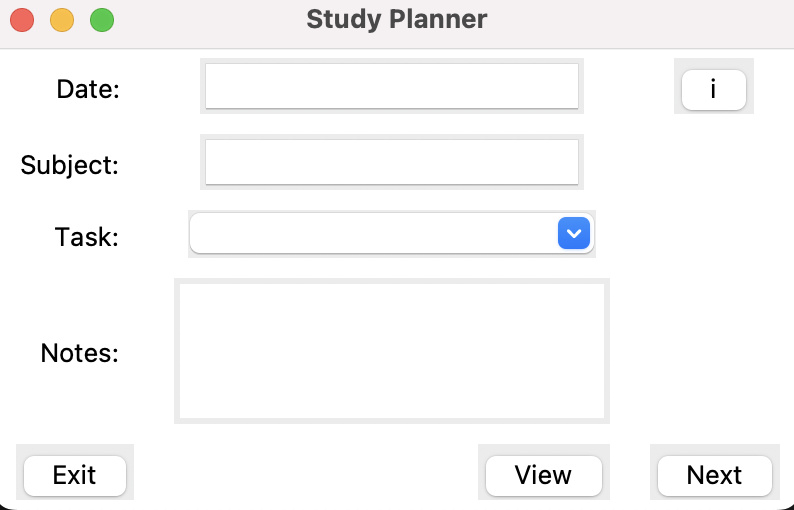
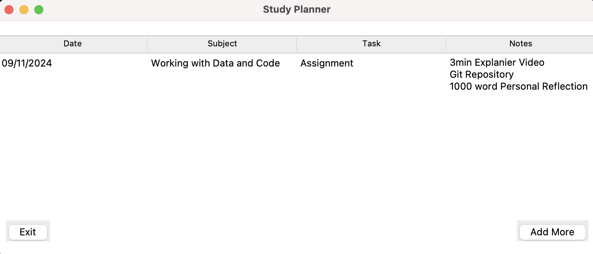

# Study-Planner-

# Project Name
> The study planner is a Python-based application designed to help students organise their study schedule. It allows users to input dates, subject, tasks, notes and view their study plan in a simple interface

## Table of Contents
* [General Info](#general-information)
* [Technologies Used](#technologies-used)
* [Features](#features)
* [Screenshots](#screenshots)
* [Setup](#setup)
* [Usage](#usage)
* [Project Status](#project-status)
* [Room for Improvement](#room-for-improvement)
* [Acknowledgements](#acknowledgements)
* [Contact](#contact)
<!-- * [License](#license) -->

## General Information

It is an application that is designed to help students manage tasks and deadlines efficiently. It helps students to stay organised and reduce the stress of poor time management. I created this project because I, too, have poor time management and also to improve my coding skills. 

## Technologies Used
- Python - version 3.12.5

## Features
List the ready features here:
- Task Input Form
- Data Validation
- Displaying Data

## Screenshots

## Setup
What are the project requirements/dependencies? Where are they listed? A requirements.txt or a Pipfile.lock file perhaps? Where is it located?

Proceed to describe how to install / setup one's local environment / get started with the project.

## Usage
How does one go about using it?
Provide various use cases and code examples here.

`write-your-code-here`

## Project Status
Project is: _in progress_ / _complete_ / _no longer being worked on_. If you are no longer working on it, provide reasons why.

## Room for Improvement
Include areas you believe need improvement / could be improved. Also add TODOs for future development.

Room for improvement:
- Improvement to be done 1
- Improvement to be done 2

To do:
- Feature to be added 1
- Feature to be added 2

## Acknowledgements
Give credit here.
- This project was inspired by...
- This project was based on [this tutorial](https://www.example.com).
- Many thanks to...

## Contact
Created by [@flynerdpl](https://www.flynerd.pl/) - feel free to contact me!

<!-- Optional -->
<!-- ## License -->
<!-- This project is open source and available under the [... License](). -->

<!-- You don't have to include all sections - just the one's relevant to your project -->
